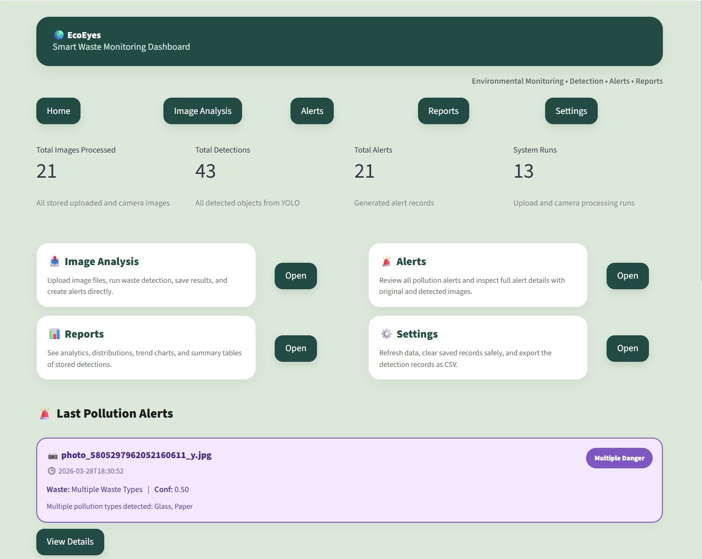
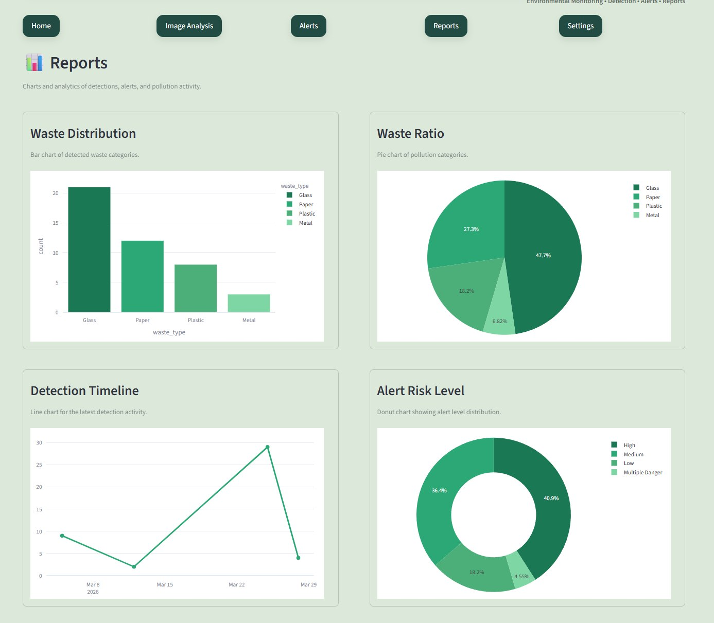
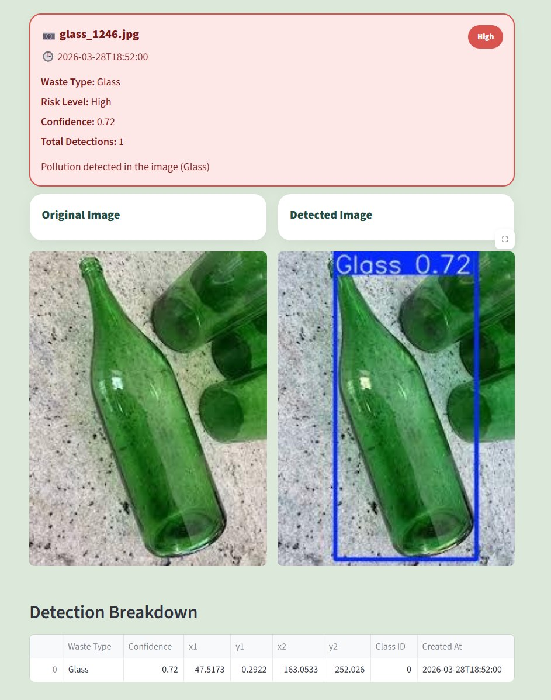
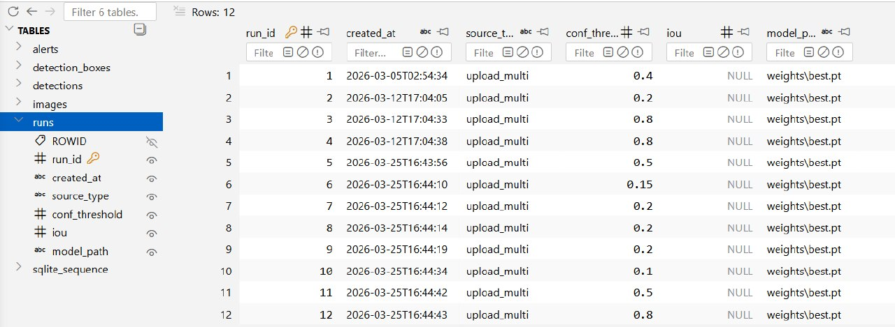

# EcoEyes

EcoEyes is an AI-powered waste detection system designed to monitor tourist areas, detect litter using YOLOv8, and generate real-time alerts with an interactive dashboard.

## Features
- Detects waste types (Plastic, Glass, Metal, Paper, Organic)
- Uses deep learning (YOLOv8)
- Interactive dashboard using Streamlit

## Technologies
- Python
- YOLOv8
- OpenCV
- Streamlit
- SQLite

## My Role
- Led the project and coordinated team tasks
- Designed and implemented the full system architecture
- Built and trained the YOLOv8 model
- Developed the Streamlit dashboard
- Integrated camera streaming with the dashboard for real-time detection
- Connected detection results with the database and alert system

## Description
EcoEyes is a smart system that detects and classifies waste from images and visualizes results through an interactive dashboard.

## Use Case
EcoEyes is designed for environmental monitoring in tourist areas where continuous manual inspection is difficult. It helps authorities detect waste early and respond quickly.

## System Workflow
1. Capture image (camera or upload)
2. Run YOLOv8 model for waste detection
3. Store results in SQLite database
4. Generate alerts based on risk level
5. Display results in dashboard

## Dashboard

## Reports

## Detection Example

## Database Storage
The system saves all detection results in a database, including the waste type, confidence, and analysis time. This helps track and analyze data over time.

